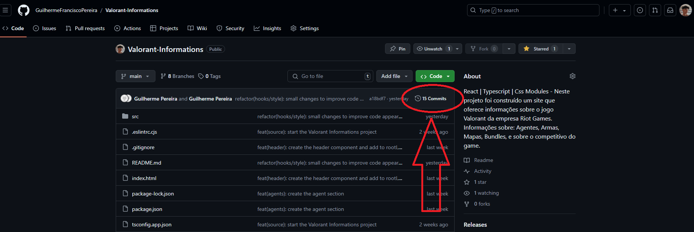
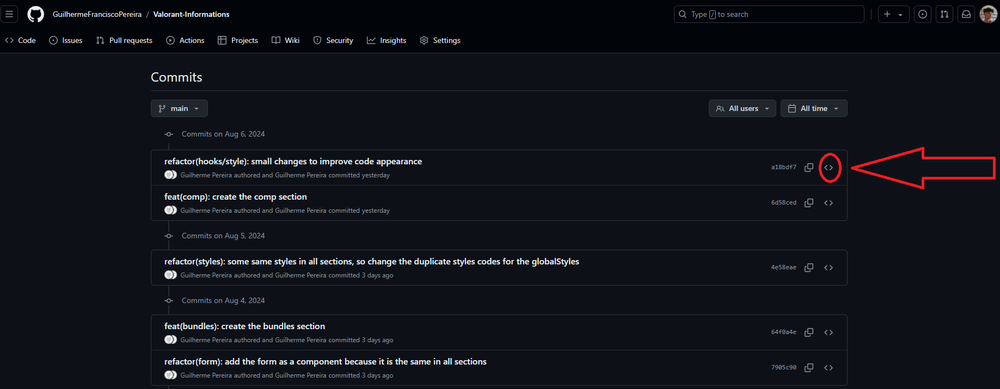
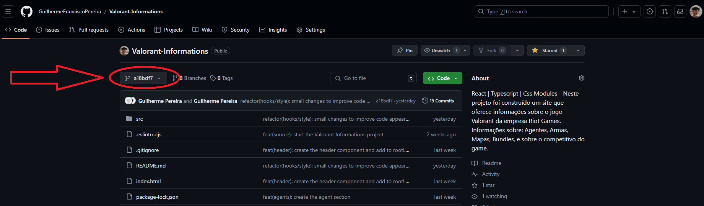

# 🎮 Projeto Valorant Informations 🎮

## 📌 Sobre o projeto:

### O Projeto Valorant Informations é um projeto em que busca entregar informações sobre o jogo Valorant da empresa Riot Games.
### Informações sobre: Agentes, Armas, Mapas, Bundles, e sobre os ranks do jogo.

##

> 🔗 Link do site: <a href="https://guilhermefranciscopereira.github.io/Valorant-Informations/" target="_blank">https://guilhermefranciscopereira.github.io/Valorant-Informations/</a>

#

## 🖥 Tecnologias Utilizadas
<div align='center'>


</div>

    - Typescript
        - Zod
    - React
        - React-query
        - Axios
        - React-hook-form
        - React-router-dom
    - Vite
        - gh-pages
    - Css Modules

## Versões utilizadas:
    - typescript: 5.2.2
    - zod: 3.23.8
    - react: 18.3.1
    - react-query: 3.39.3
    - axios: 1.7.2
    - react-hook-form: 7.52.1
    - react-router-dom: 6.25.1
    - vite: 5.3.4
    - gh-pages: 6.1.1

## 🙋🏻‍♂ Como me localizar no projeto?

### Todos os arquivos de código fonte do projeto estão em: `./src`

## 🛈 Como o projeto está estruturado

- `./src/@types:` Para que o código não acuse erros ao fazer a importação de algum module.css, com o arquivo module.d.ts fazemos a configuração em uma linha para o código aceitar o nosso caminho de importação que contenha module.css no final.

- `./src/assets:` Onde está todas as fotos que vão ser usadas no projeto.

- `./src/components:` Onde está os componentes que serão reutilizados em diversas partes do código. Nessa primeira versão temos o: Header e o Form.

- `./src/contexts:` Os contexts são onde separamos os dados que serão compartilhados com toda a aplicação, neste projeto é onde fica os nomes dos agentes, armas e mapas que são recebidos atráves do form ou quando o úsuario clica em um card, e então é compartilhado com os arquivos que são responsáveis por renderizar a escolha do úsuario.

- `./src/hooks:` Está nossos hooks personalizados. 

- `./src/pages:` É onde está as "páginas inteiras" de cada seção. É a "raiz" de cada seção do nosso código.

- `./src/routes:` Com um único arquivo "Router.tsx" que é responsável pelas rotas da nossa aplicação, e com o "Outlet" que está em: ( pages > RootLayout ) conseguimos criar uma SPA (Single Page Application).

- `./src/services:` Um único arquivo "queryClient.ts" que serve somente para criarmos um queryClient para o provider do nosso contexto.

- `./src/styles:` Também um único arquivo, "globalStyles.css", este arquivo fica responsável pelos códigos que são globais do projeto.

## ❔ Como rodar o projeto na minha máquina?

- Antes de tudo, você precisa ter o Git instalado no seu computador. O Git é uma ferramenta que permite clonar e gerenciar repositórios de código.
    - Windows: Baixe o Git <a href="https://git-scm.com/download/win" target="_blank">aqui</a> e siga as instruções de instalação.
    - macOS: Você pode instalar o Git <a href="https://git-scm.com/download/mac" target="_blank">aqui</a> ou usando o Homebrew com o comando brew install git:
        ```bash
        brew install git
        ```
    - Linux: Use o gerenciador de pacotes da sua distribuição, por exemplo para Debian/Ubuntu:
        ```bash
        sudo apt install git
        ```

- Abra o terminal (no Windows, você pode usar o Git Bash, que é instalado junto com o Git).

- Navegue até o diretório onde deseja armazenar o projeto.

- Execute o comando para clonar o repositório:

    ```bash
    git clone https://github.com/GuilhermeFranciscoPereira/Valorant-Informations.git
    ```
- Após clonar o repositório, navegue até a pasta do projeto
    ```bash
    cd Valorant-Informations
    ```

- Agora você pode abrir os arquivos do projeto com seu editor de texto ou IDE preferido. Exemplo do vsCode: 
    ```bash
    code .
    ```

- 🚨 Não esqueça que para não ocorrer erros no código ao clonar ele, você deve fazer o comando abaixo 🚨
    ```bash
    npm i   
    ```

## ⚠ Informações importantes sobre o projeto ⚠

### Todos os commits do projeto possui um readme detalhado do que foi feito naquele commit. Os de criações de seções possuem as fotos da primeira versão do site, então caso deseje ver o processo de criação do código viaje pelos commits e veja as informações!

### Como fazer isso? 

Para você ver o processo de criação e o que foi feito em cada commit siga o passo-a-passo:

- Primeiro: Nessa guia em que você está, suba a tela até encontrar embaixo do botão verde um local igual o da foto abaixo e então clique nele


- Segundo: No lado direito dos commits você encontra clique no simbolo de <> como está na foto e então você irá encontrar como o código estava naquele momento e o readme detalhado daquele momento!


- Terceiro: Depois de encontrar tudo que deseja, caso queira voltar para cá, você irá clicar no local em que a imagem a baixo mostra:

E então clique em "main" e voltará para cá!

##

## 🎉 É isso! Esse foi o nosso projeto, caso tenha ficado com alguma dúvida ou deseje complementar algo diretamente comigo você pode estar entrando em contato através do meu LinkedIn

> Link do meu LinkedIn: <a href="https://www.linkedin.com/in/guilherme-francisco-pereira-4a3867283" target="_blank">https://www.linkedin.com/in/guilherme-francisco-pereira-4a3867283</a>

### 🚀 Obrigado pela atenção e espero que tenha gostado do que tenha visto aqui, que tal agora dar uma olhada nos meus outros repositórios? 👋🏻

#### Créditos dos emojis: <a href="https://emojipedia.org" target="_blank">https://emojipedia.org</a>'