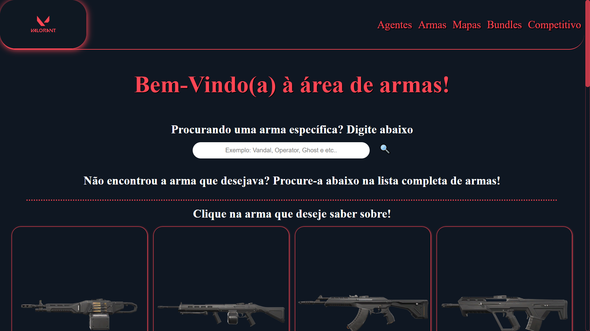
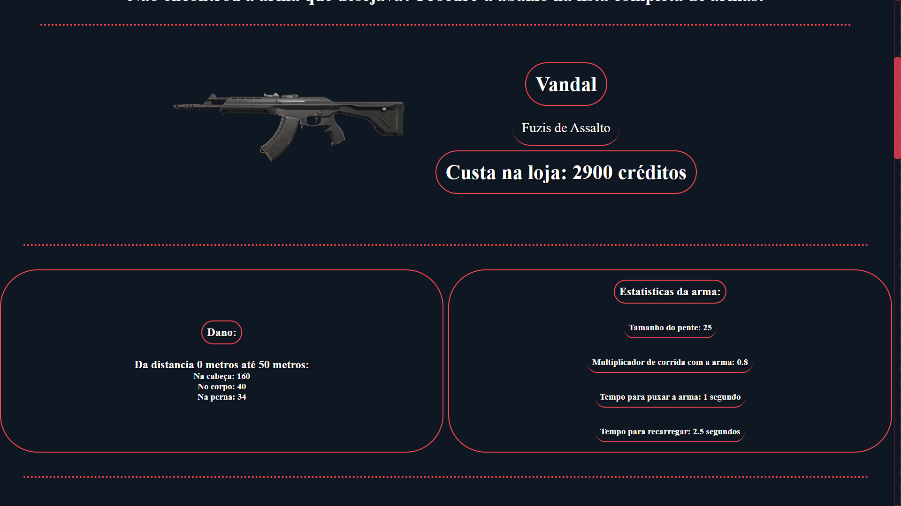
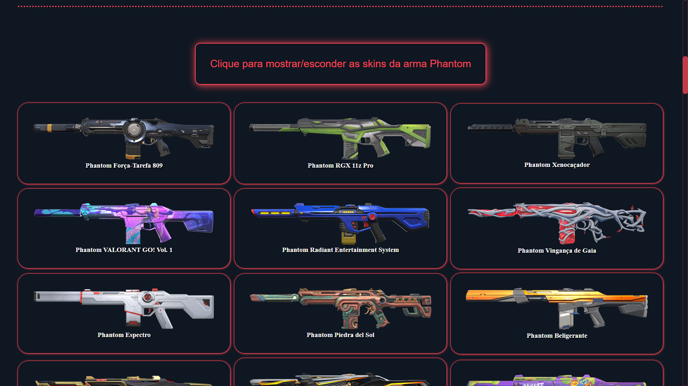
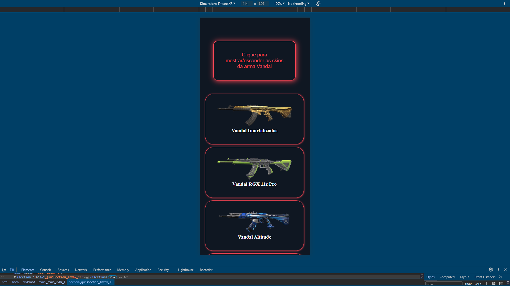

# Projeto Valorant Informations

> Link do site: https://guilhermefranciscopereira.github.io/Valorant-Informations/

## Prints das telas da aba de armas no fim deste readMe!

> Commit do dia: 01/08/2024 - 12:09

## Alterações deste commit: 
- Criação das pastas: (contexts > guns / hooks > guns / pages > Guns).
Criei o contexto de guns e em pages > Guns criei o module.css e o conteúdo da página.

- Adicionei o context de Guns em contexts > App.tsx para compartilhar tudo de uma única vez no provider de App.tsx

- Criei os hooks da seção de armas para implementar em pages > Guns

- Alterações na pasta pages > Agents, criei o nosso module.css e adicionei a estrutura da aba Agentes do site. 

- Pequena mudança em: hooks > agents > ShowAgentChoosed.tsx. Onde adicionei um "}" que faltou para o IF

## Prints das telas da aba de armas (pc / mobile):

### Tela de início da seção de armas

### Após clicar ou digitar o nome da arma irá aparecer essa tela para informar sobre o arma

### Tela de skins da arma escolhida

### Tela de início da seção de armas ( celular )

### Tela de skins da arma escolhida ( celular )
