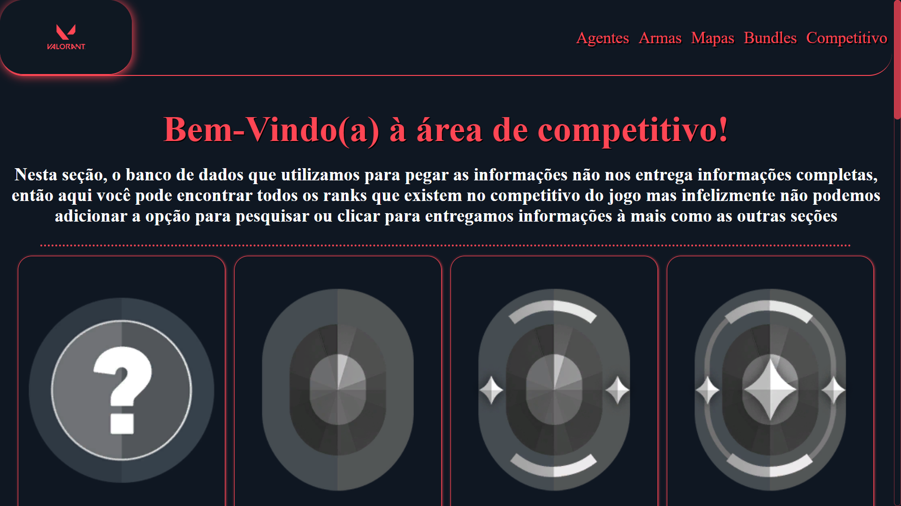
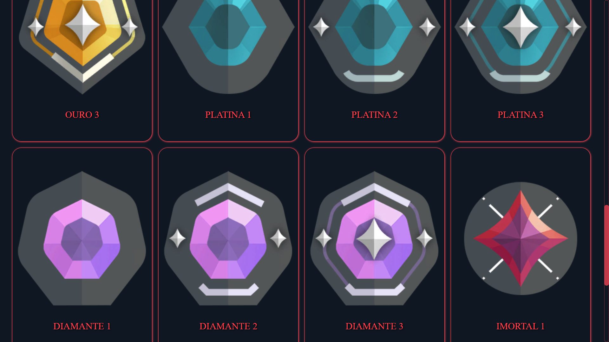
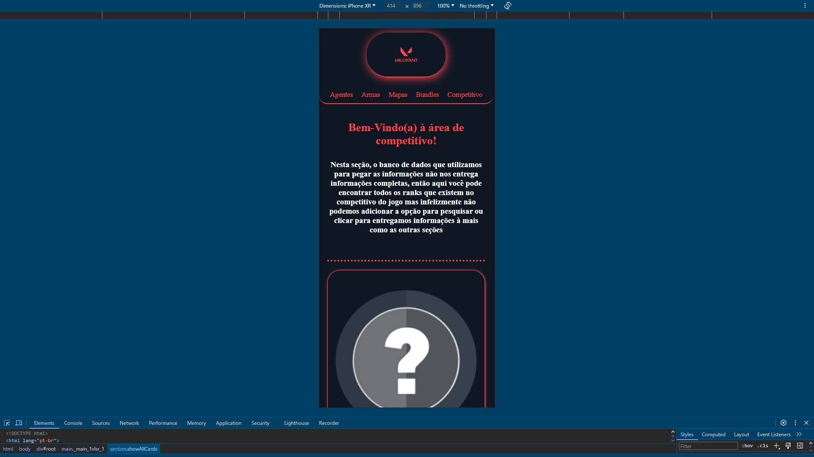
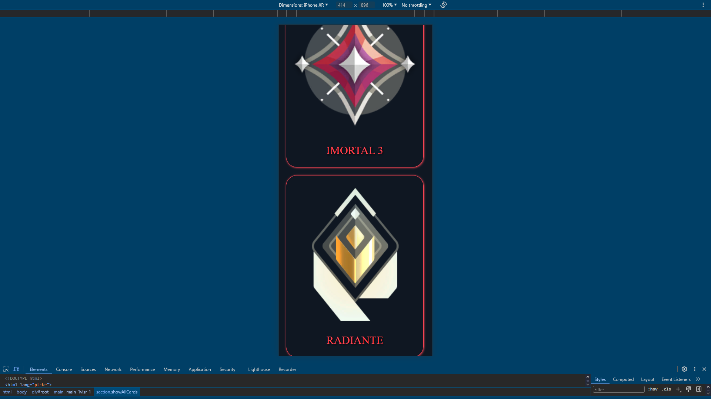

# Projeto Valorant Informations

> Link do site: <a href="https://guilhermefranciscopereira.github.io/Valorant-Informations/" target="_blank">https://guilhermefranciscopereira.github.io/Valorant-Informations/</a>

## Prints das telas da aba do competitivo no fim deste readMe!

> Commit do dia: 06/08/2024 - 14:45

## Alterações deste commit: 
- Alterações das pastas: (hooks / pages )

### hooks:

- hooks > comp: Criado o arquivo ShowAllComps.tsx para renderizar na tela todos os ranks do jogo

### pages:

- pages > comp: Adicionado a estrutura no index.tsx

## Prints das telas da aba do competitivo (pc / mobile):

### Tela de início da seção do Comp

### Tela de todos os Ranks

### Tela de início da seção de Comp ( Mobile )

### Tela de todos os Ranks ( Mobile )
