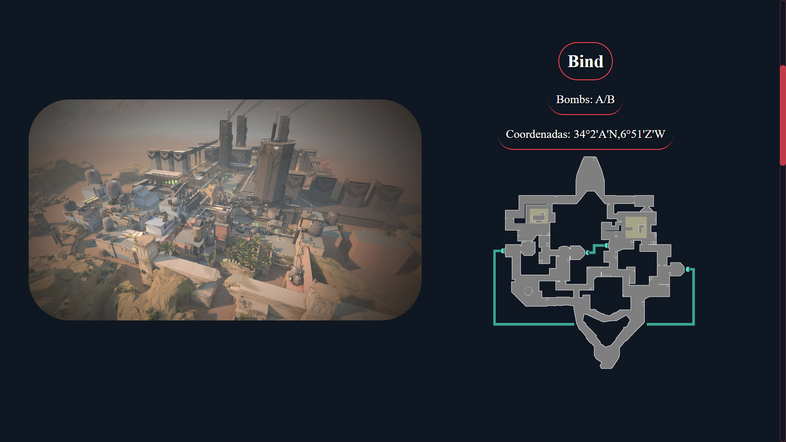
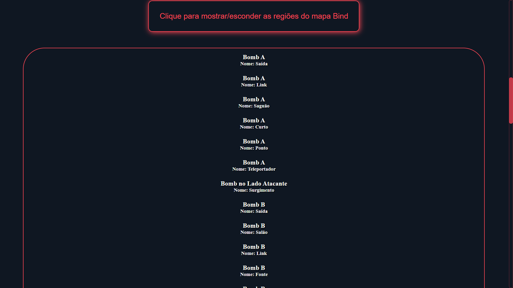
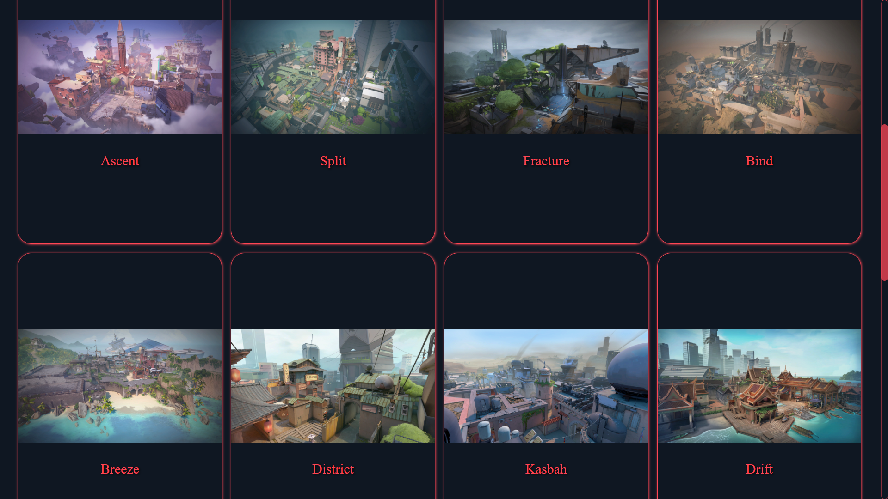
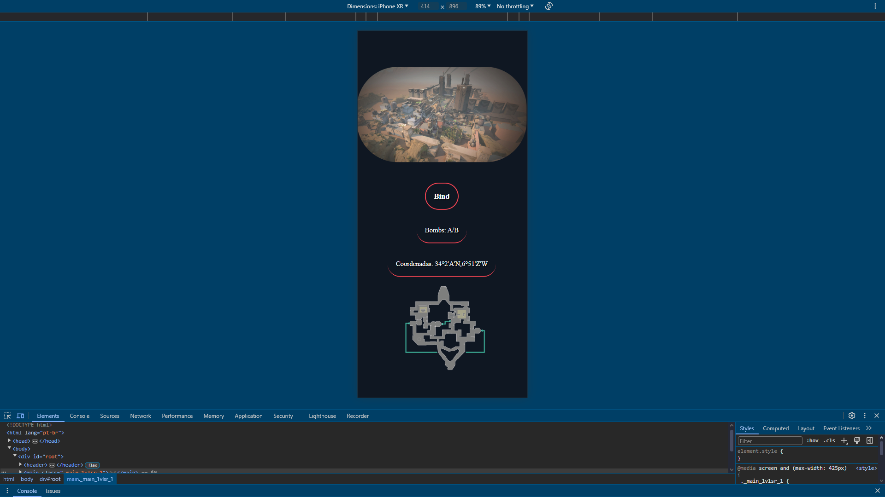
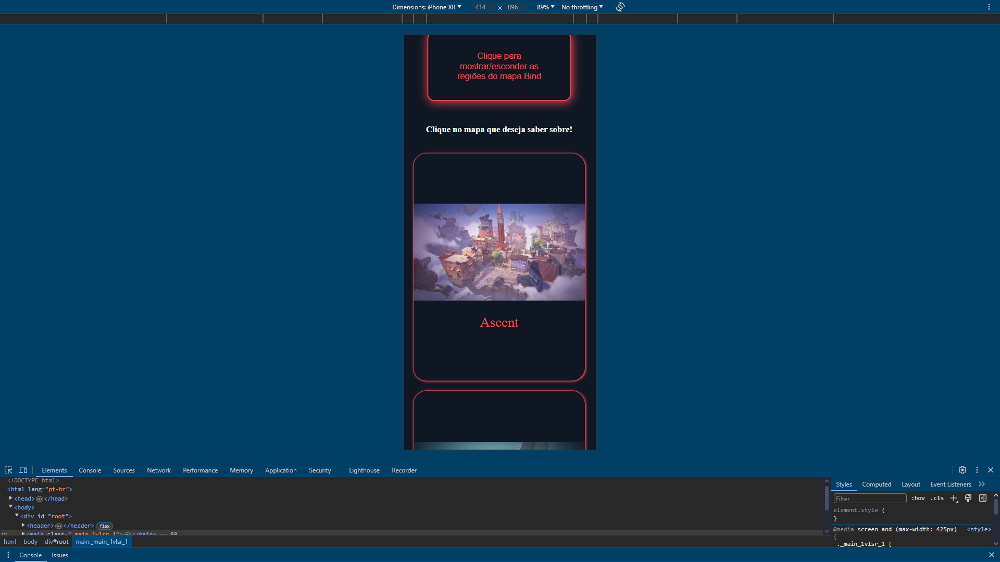

<!-- # Projeto Valorant Informations

> Link do site: https://guilhermefranciscopereira.github.io/Valorant-Informations/

## Prints das telas da aba de mapas no fim deste readMe!

> Commit do dia: 02/08/2024 - 08:26

## Alterações deste commit: 
- Alterações das pastas: (contexts / hooks / pages )

### contexts 
- contexts > agents: para ficar igual as outras seções eu removi o finally em hooks > agents > ShowAgentChoosed e adicionei ao context para ser ativado assim que for feita a requisição para qualquer agente.

- contexts > maps: Criei o contexto de mapas para ser compartilhado com qualquer parte do código e adicionei esse contexto ao: context > AppContext.tsx (Responsavel por ir ao App.tsx).

### hooks:

- hooks > agents: Pequenas correções e alterações no arquivo ShowAgentChoosed.tsx. Além de renomear as pastas que estavam com a primeira letra minuscula para maiuscula (PascalCase)

- hooks > guns: Apenas removi o motivo do erro do alert no arquivo ShowGunChoosed.tsx - Muitos usuarios não iriam entender então só deixei a mensagem padrão.

- hooks > maps: Criado todo o hook da seção de mapas.

### pages:

- pages > Agents: Nenhuma alteração. Apenas corrigindo o import para o novo dos arquivos em hooks, onde foi renomeado como PascalCase

- pages > Guns: Nenhuma alteração. Apenas corrigindo o import para o novo dos arquivos em hooks, onde foi renomeado como PascalCase

- pages > Maps: Adicionado a estrutura no index.tsx e criado o arquivo Maps.module.css para a estilização.

## Prints das telas da aba de mapas (pc / mobile):

### Tela de início da seção de mapas

### Após clicar ou digitar o nome do mapa irá aparecer essa tela para informar sobre o mapa

### Após clicar para ver as regiões do mapa

### Tela de todos os mapas

### Após clicar ou digitar o nome do mapa irá aparecer essa tela para informar sobre o mapa ( celular )

### Tela de todos os mapa ( celular )
 -->

# Projeto Valorant Informations

> Link do site: https://guilhermefranciscopereira.github.io/Valorant-Informations/

## Commit para melhorar o código. O Input em que o úsuario usa para procurar o que deseja da aba, estava sendo o mesmo para todos. Então mudei de local para usar em Components, como um componente que pode ser reutilizado por outras partes do código.

> Commit do dia: 04/08/2024 - 19:32

## Alterações deste commit: 
- Alterações das pastas: (components / contexts / pages )

### components 
- components > Form: Apenas mudando o form para um único local, com um arquivo index.tsx que é o mesmo código do Form mas que recebe parâmetros para apenas mudar o placeholder do input e também a função da seção para alterar a pesquisa atual do úsuario. E outro arquivo Form.modules.css para a estilização do form.

### contexts
- contexts > agents / guns / maps: Apenas uma alteração, onde foi alterado o id que é buscado no querySelector.

### pages
- pages > Agents / Guns / Maps: Alterado o arquivo index.tsx para adicionar o novo caminho do form e passando as props necessárias para aquela seção. Além de alterar a estilização para remover as estilizações do form que foi alterado para components > Form > Form.module.css