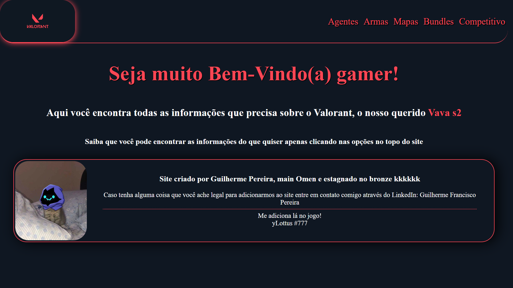
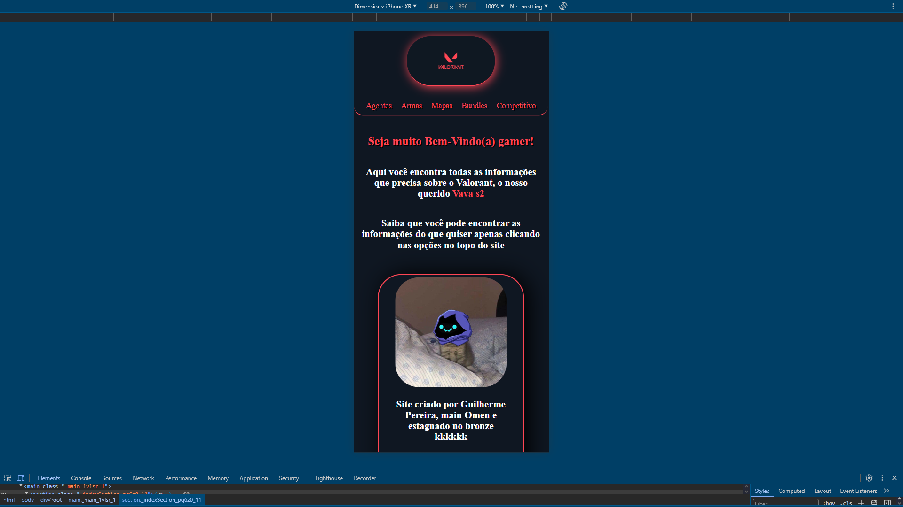

# Projeto Valorant Informations

> Link do site: https://guilhermefranciscopereira.github.io/Valorant-Informations/

## Prints das telas do Index (pc / mobile):

## Alterações deste commit: 
- Na pasta assets, criei o arquivo .tsx (omenCat) foto que fica no index do site, e adicionei dois prints para demonstração de como estão as telas, para pc e para mobile.
- Pages > Index: Criei o Index do site e também a pasta module.css para a estilização e responsividade

> Commit do dia: 29/07/2024 - 20:36