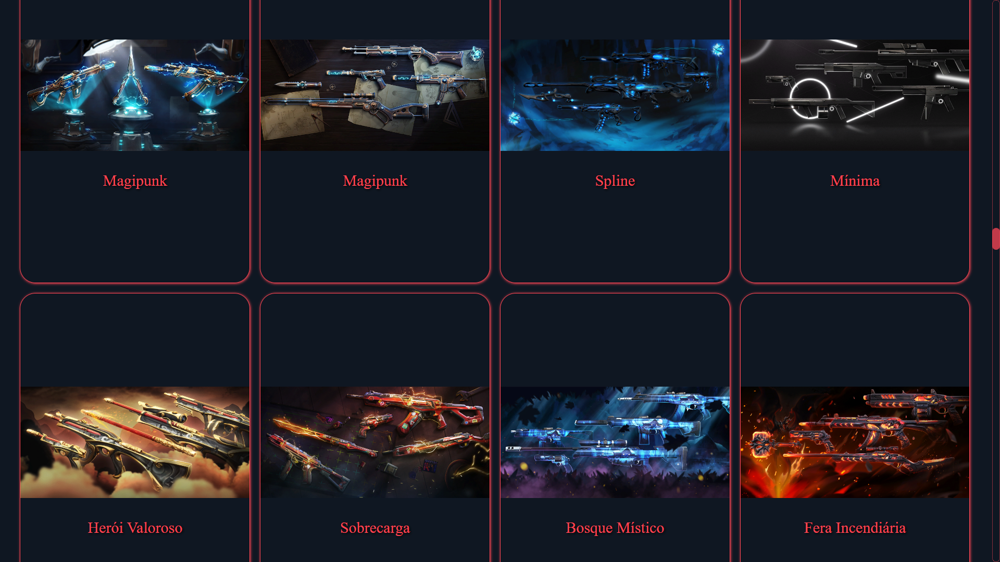
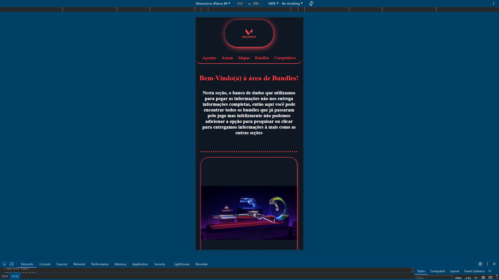
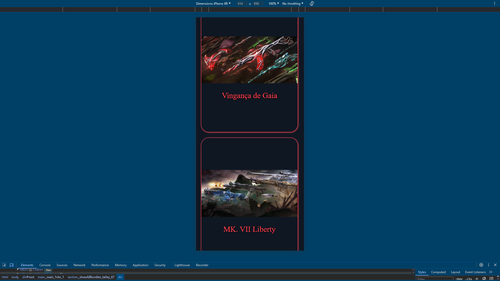

<!-- # Projeto Valorant Informations

> Link do site: https://guilhermefranciscopereira.github.io/Valorant-Informations/

## Prints das telas da aba de bundles no fim deste readMe!

> Commit do dia: 04/08/2024 - 23:09

## Alterações deste commit: 
- Alterações das pastas: (hooks / pages )

### hooks:

- hooks > bundles: Criado o arquivo ShowAllBundles.tsx para renderizar na tela todos os bundles do jogo

### pages:

- pages > Bundles: Adicionado a estrutura no index.tsx e criado o arquivo Bundles.module.css para a estilização.

- pages > Index: Adicionado o link do meu LinkedIn na tela inicial com uma tag "a", e feito uma pequena alteração nessa tela no Index.module.css 

## Prints das telas da aba de Bundles (pc / mobile):

### Tela de início da seção de Bundles

### Tela de todos os Bundles

### Tela de início da seção de Bundles ( Mobile )

### Tela de todos os Bundles ( Mobile )
 -->

# Projeto Valorant Informations

> Link do site: https://guilhermefranciscopereira.github.io/Valorant-Informations/

## Commit para melhorar o código. Percebi que os códigos de estilizações eram literalmente os mesmos para a área do começo da seção e a seção de Cards. Então para melhorar o código eu optei por adicionar esses códigos que eram o mesmo para: styles > globalStyles.css

> Commit do dia: 05/08/2024 - 00:21

## Alterações deste commit:
### Alterações das pastas: (hooks / pages / styles )

### hooks
- hooks: Alterações de todos os arquivos dos Hooks que possuem no começo ShowAll, mas apenas para alterar como era adicionado a estilização do componente. Ao invés de ser adicionado ao module.css da respectiva seção agora é adicionado para o style global. Chamando ele com um import simples no topo do código e passando o className de forma direta com as aspas.

### pages
- pages > Agents/Guns/Maps: Alterações dos arquivos module.css, removendo todos os códigos repetitivos que foram adicionados como um só em styles > globalStyles.css

- pages > Bundles: Removido o arquivo Bundles.module.css pois não havia nenhum código único nele, toda a estilização já está contida no globalStyles.css 

### styles
- styles > globalStyles.css: Adicionado os códigos de estilizações repetidos para serem compartilhados de forma global.